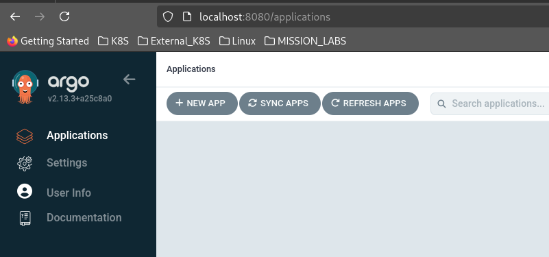

# Create a Grafana dashboard inside Kubernetes to examine the National Grid Power Mix

Project to create a grafana dashboard to scrape the National Energy System Operators Carbon Intesity Operator https://api.carbonintensity.org.uk/

## Provision a Google Cloud GCP GKE Autopilot Cluster

Not for production use.

### Bootstrapping

````
cd bootstrap
cat README.md
````
Read that README.md to see how to bootstrap the cluster through Github Actions.

# Argo Setup

Once the Github actions have run, replace the SecretsManager secrets with the URL of the repository and your PAT token

````
{"gh_pat_token":"REPLACE ME!","url":"https://github.com/tommybobbins/potential-disco"}
````

### Accessing Argo post deployment

Gain Kubernetes Cluster credentials

````
$ export KUBECONFIG=~/.kube/config
$ export KUBE_CONFIG_PATH=${KUBECONFIG}

$ gcloud container clusters get-credentials $PROJECT_ID-gke --region europe-west2
Fetching cluster endpoint and auth data.
WARNING: cluster wibble-flibble-123456789-gke is not RUNNING. The kubernetes API may or may not be available. Check the cluster status for more information.
````


Access Argo using Port forwarding
````
$ kubectl -n argocd get secret argocd-initial-admin-secret -o jsonpath="{.data.password}" | base64 -d; echoho

StringofAdminPasswordReturned

$ kubectl port-forward svc/argocd-server -n argocd 8080:443
Forwarding from 127.0.0.1:8080 -> 8080
Forwarding from [::1]:8080 -> 8080
````



## Test running pod

````
tng@jake:~/potential-disco/helm/curl-test$ kubectl expose deployment/bobbins --name bobbins --port=9200
service/bobbins exposed
tng@jake:~/potential-disco/helm/curl-test$ kubectl get svc
NAME         TYPE        CLUSTER-IP     EXTERNAL-IP   PORT(S)    AGE
bobbins      ClusterIP   10.192.99.60   <none>        9200/TCP   13s
kubernetes   ClusterIP   10.192.0.1     <none>        443/TCP    97m
tng@jake:~/potential-disco/helm/curl-test$ kubectl describe svc bobbins
Name:              bobbins
Namespace:         default
Labels:            app=bobbins
Annotations:       cloud.google.com/neg: {"ingress":true}
Selector:          app=bobbins
Type:              ClusterIP
IP Family Policy:  SingleStack
IP Families:       IPv4
IP:                10.192.99.60
IPs:               10.192.99.60
Port:              <unset>  9200/TCP
TargetPort:        9200/TCP
Endpoints:         10.96.1.8:9200
Session Affinity:  None
Events:
  Type    Reason                          Age                From                   Message
  ----    ------                          ----               ----                   -------
  Normal  ADD                             23s                sc-gateway-controller  default/bobbins
  Normal  DNSRecordProvisioningSucceeded  22s (x4 over 22s)  clouddns-controller    DNS records updated
tng@jake:~/potential-disco/helm/curl-test$ kubectl exec busybox-curl -it /bin/sh
kubectl exec [POD] [COMMAND] is DEPRECATED and will be removed in a future version. Use kubectl exec [POD] -- [COMMAND] instead.
/bin/sh: shopt: not found
[ root@busybox-curl:/ ]$ curl bobbins:9200
# HELP carbon_intensity_generation_mix Generation mix (percentage)
# TYPE carbon_intensity_generation_mix gauge
carbon_intensity_generation_mix{fuel="biomass"} 8.5
carbon_intensity_generation_mix{fuel="coal"} 0
carbon_intensity_generation_mix{fuel="gas"} 14.1
carbon_intensity_generation_mix{fuel="hydro"} 0.1
carbon_intensity_generation_mix{fuel="imports"} 10.8
carbon_intensity_generation_mix{fuel="nuclear"} 12.1
carbon_intensity_generation_mix{fuel="other"} 0
carbon_intensity_generation_mix{fuel="solar"} 15.5
carbon_intensity_generation_mix{fuel="wind"} 38.8
````


