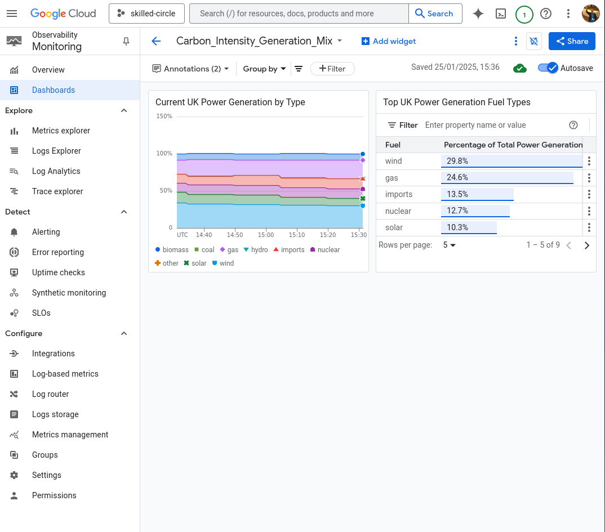
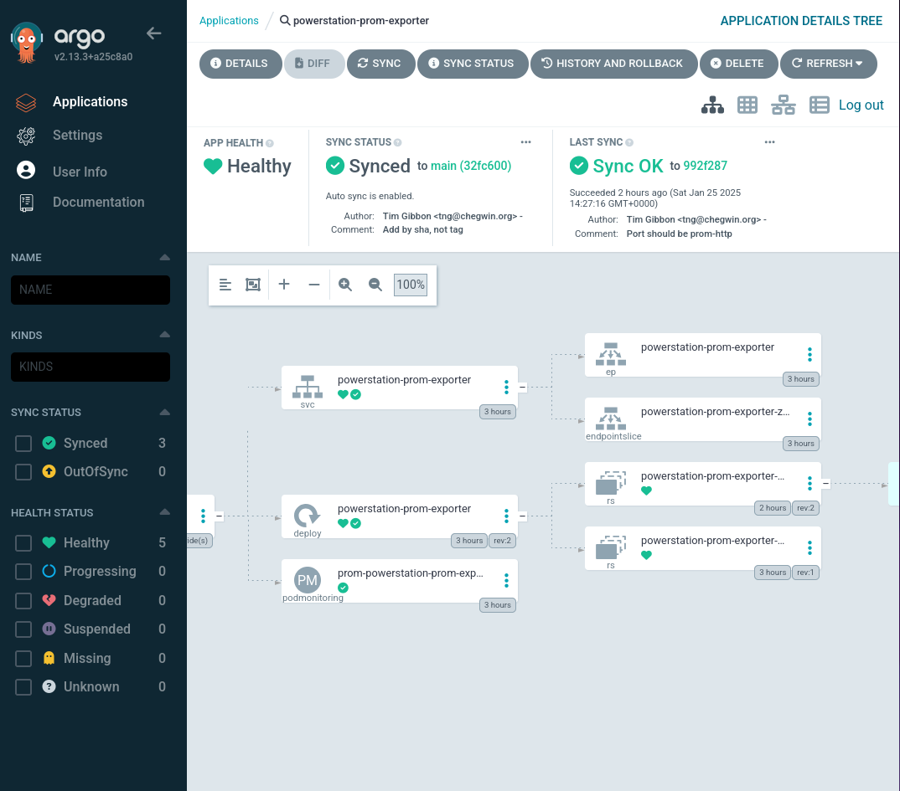

# Create a Google Cloud Observability Monitoring dashboard inside Kubernetes to examine the National Grid Power Mix

Project to create a dashboard to scrape the National Energy System Operators Carbon Intesity Operator https://api.carbonintensity.org.uk/ using Kuberrnetes. This is overkill to deploy a single pod, but it proves useful as a bookmark for bootstrapping GCloud, Deploying GKE Autopilot, Deploying Argo automating via Github Actions and using Google Cloud's own Prometheus pod scraping.



Autopilot and the Prometheus operator do not play nicely together by default without increasing the threshold limits. I was unwilling to do this, so rewrote the project using GKE built-in Prometheus and displaying the results in an Observability Monitoring dashboard.

## Provision a Google Cloud GCP GKE Autopilot Cluster

Not for production use.

### Bootstrapping

````
cd bootstrap
cat README.md
````
Read that README.md to see how to bootstrap the cluster through Github Actions.

# Argo Setup

Once the Github actions have run, replace the SecretsManager secrets with the URL of the repository and your PAT token

````
{"gh_pat_token":"REPLACE ME!","url":"https://github.com/tommybobbins/potential-disco"}
````

### Accessing Argo post deployment

Gain Kubernetes Cluster credentials

````
$ export KUBECONFIG=~/.kube/config
$ export KUBE_CONFIG_PATH=${KUBECONFIG}

$ gcloud container clusters get-credentials $PROJECT_ID-gke --region europe-west2
Fetching cluster endpoint and auth data.
WARNING: cluster wibble-flibble-123456789-gke is not RUNNING. The kubernetes API may or may not be available. Check the cluster status for more information.
````

Access Argo using Port forwarding
````
$ kubectl -n argocd get secret argocd-initial-admin-secret -o jsonpath="{.data.password}" | base64 -d; echo

StringofAdminPasswordReturned

$ kubectl port-forward svc/argocd-server -n argocd 8080:443
Forwarding from 127.0.0.1:8080 -> 8080
Forwarding from [::1]:8080 -> 8080
````

Enter the credentials taken from the get secret call above.


The Argo application deploymend is Automated, so using the pat token it should automatically create the application. The project name is passed through as a parameter, you may also need to set the image tag on the container as it has been set as a sha256 sum. This is set in helm/powerstation-prom-exporter/values.yaml.

````
grep tag helm/powerstation-prom-exporter/values.yaml 
  # Overrides the image tag whose default is the chart appVersion.
  tag: "@sha256:271881054e744afcc162376abdf6f364445d5946ebdf1bff3ed9191222cbcc69"
````



## Test running pod

Deploy the curl-test pod in the scrapers namespace

````
tng@jake:~/potential-disco/helm/curl-test$ kubectl exec busybox-curl -it /bin/sh
kubectl exec [POD] [COMMAND] is DEPRECATED and will be removed in a future version. Use kubectl exec [POD] -- [COMMAND] instead.
/bin/sh: shopt: not found
[ root@busybox-curl:/ ]$ curl powerstation-prom-exporter:9200
# HELP carbon_intensity_generation_mix Generation mix (percentage)
# TYPE carbon_intensity_generation_mix gauge
carbon_intensity_generation_mix{fuel="biomass"} 8.5
carbon_intensity_generation_mix{fuel="coal"} 0
carbon_intensity_generation_mix{fuel="gas"} 14.1
carbon_intensity_generation_mix{fuel="hydro"} 0.1
carbon_intensity_generation_mix{fuel="imports"} 10.8
carbon_intensity_generation_mix{fuel="nuclear"} 12.1
carbon_intensity_generation_mix{fuel="other"} 0
carbon_intensity_generation_mix{fuel="solar"} 15.5
carbon_intensity_generation_mix{fuel="wind"} 38.8
````


