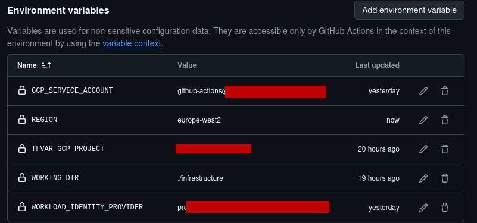

# Github actions to GCP OIDC integration

## Not for production use.


### Deployment

Create a tofu.tfvars file containing something similar to the following:

    credentials_file  = "wibbly-flibble-stuff-morestuff.json"
    project           = "wibble-flibble-numbers"
    region            = "europe-west2"

Example for creating service account
````
$ export PROJECT_ID=wibble-flibble-123456
$ gcloud config set project $PROJECT_ID
$ gcloud auth application-default login
$ gcloud config set project ${PROJECT_ID}
$ gcloud storage buckets create gs://${PROJECT_ID}-terraform --project $PROJECT_ID --location europe-west2
$ gcloud iam service-accounts create tofu-deployer
$ gcloud projects add-iam-policy-binding $PROJECT_ID --member="serviceAccount:tofu-deployer@${PROJECT_ID}.iam.gserviceaccount.com" --role=roles/editor
$ gcloud projects add-iam-policy-binding $PROJECT_ID --member="serviceAccount:tofu-deployer@${PROJECT_ID}.iam.gserviceaccount.com" --role=roles/resourcemanager.projectIamAdmin
$ gcloud projects add-iam-policy-binding $PROJECT_ID --member="serviceAccount:tofu-deployer@${PROJECT_ID}.iam.gserviceaccount.com" --role=roles/container.admin
$ gcloud projects add-iam-policy-binding $PROJECT_ID --member="serviceAccount:tofu-deployer@${PROJECT_ID}.iam.gserviceaccount.com" --role=roles/container.admin
$ gcloud projects add-iam-policy-binding $PROJECT_ID --member="serviceAccount:tofu-deployer@${PROJECT_ID}.iam.gserviceaccount.com" --role=roles/secretmanager.admin
````

Create the service account keys which will be used for tofu wibbly-flibble-stuff-morestuff.json using:

````
    $ gcloud iam service-accounts keys create gcp_deployment_creds.json  \
    --iam-account=tofu-deployer@${PROJECT_ID}.iam.gserviceaccount.com
created key [123456abcdef1234] of type [json] as [gcp_deployment_creds.json] for [tofu-deployer@wibble-flibble-123456.iam.gserviceaccount.com]
````

Edit the version.tf and ensure the bucket is the one created above for your project:

````
  backend "gcs" {
    # Change this to your bucket
    bucket = "wibble-flibble-123456-terraform" # need to update with the bucket name
````


Run the standard terraform deployment:
   ```
   $ tofu init
   $ tofu plan
   $ tofu apply
   ```

For the bootstrap enabling apis, some have to be imported manually:
````
$ tofu state rm "google_project_service.service[\"oslogin.googleapis.com\"]"
$ tofu state rm "google_project_service.service[\"iamcredentials.googleapis.com\"]"
$ tofu import "google_project_service.service[\"oslogin.googleapis.com\"]" "${PROJECT_ID}/oslogin.googleapis.com"
$ tofu import "google_project_service.service[\"iamcredentials.googleapis.com\"]" "${PROJECT_ID}/iamcredentials.googleapis.com"
$ tofu apply
````
## Github actions setup

Create a set of ENVIRONMENT variables TFVAR_GCP_PROJECT, GCP_SERVICE_ACCOUNT, WORKING_DIR and WORKLOAD_IDENTITY_PROVIDER against a new Github environment PRD in Repo Name->Settings->Secrets and variables->Actions


Create a personal access token for just this repository. Github->Click user icon->Developer settings->Personal Access tokens->Fine Grained access tokens->generate new token. Make a note of the token and add this into the Repository as a secret named REPO_PAT_TOKEN using Repo Name->Settings->Secrets and Variables->Secrets

